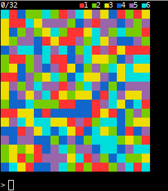

Flood fill puzzle game for linux terminals

# Gameplay

You start in the upper left hand corner of the board. Enter a number (1-6) to
flood all adjacent filled cells with that color. The aim of the game is to try
to fill the entire board with a single color in less than 32 moves.

Inspred by [Open Flood](https://github.com/GunshipPenguin/open_flood/)
